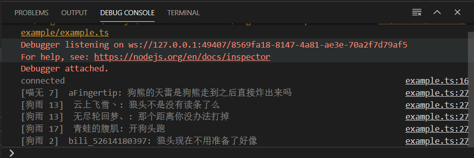

Please use [blive-message-listener](https://npmjs.com/blive-message-listener)
----
# Bilibili live danmaku


获取B站直播间弹幕及人气值。

仅可用于`Node`

## 安装

```shell
yarn add bili-live-danmaku
```

## 用法

内置普通文本（弹幕）包解析： `DanmakuMessage`

```typescript
import {LiveClient, BilibiliClient, DanmakuMessage} from 'bili-live-danmaku'
async function main() {
  const bilibiliClient = new BilibiliClient()
  bilibiliClient.loginResponse = 'true'
  const liveClient = new LiveClient(bilibiliClient, 102)
  liveClient.onClose = reason => {
    console.log('')
    console.log('Closed: ')
    console.log(reason.message)
  }
  liveClient.onConnect = () => {
    console.log('connected')
  }
  liveClient.onPopularityPacket = popularity => {
    console.log(`人气值: ${popularity}`)
  }
  liveClient.onCommandPacket = command => {
    if (command.cmd === 'DANMU_MSG') {
      const dmk = new DanmakuMessage(command)
      const outs = `${
        dmk.hasFansMedal ? `[${dmk.fansMedalName} ${dmk.fansMedalLevel}] ` : ''
      } ${dmk.nickname}: ${dmk.message}`
      console.log(outs)
    }
  }
  await liveClient.launch()
}

main()
```



---

## Credits

- https://github.com/SocialSisterYi/bilibili-API-collect
- https://github.com/czp3009/bilibili-api
